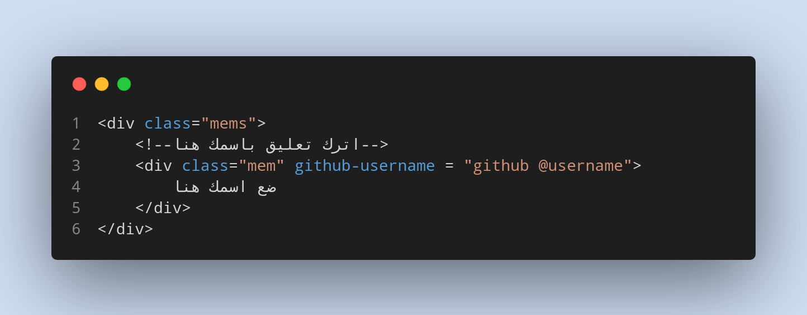

# مرحبا..

يمكنك عمل``` fork```  للكود  ثم عدل على  ملف ```index.html```

* توجه الى العنصر ```<div class = "mems"></div>```
* ثم اضف بداخله عنصر ```<div>``` بهذه المواصفات 

```html
<!-- your name -->
<div class="mem" github-username = "your github @username">
       your name 
</div>
```

:heavy_check_mark: تاكد ان العنصر الذي انشاته له ```class``` باسم ```mem```

:heavy_check_mark: لا تنسى ان تضيف اسم المستخدم الخاص بك على ```github``` و احرص على ان  يكون صحيحا

```html
<!-- Exemple -->
<div class="mem" github-username = "@MohammedChaker">
```

* في الاخير قم بعمل ```pull request```

