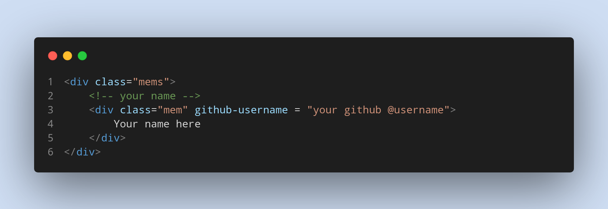

# Welcome to [My-happy-team](https://github.com/my-happy-team/)

## Join us 

 First *[Fork](https://github.com/my-happy-team/join-us)* this repository and then edit *index.html* .

* Go to the `<div class = "mems"></div>`.
* Then add a `<div>` element inside of it :

```html
<!-- add your name -->
<div class="mem" github-username = "your github @username">
       YOUR NAME 
</div>
```

:heavy_check_mark: Please Make sure that your element has ```class="mem"```.

:heavy_check_mark: Do not forget to add your **github username** and make sure that it is correct.

```html
<!-- Example -->
<div class="mem" github-username = "@MohammedChaker">
```

* Click on [Create Pull Request](https://github.com/my-happy-team/join-us/compare).
* Voila! You have made a PR to this project. Sit back and relax while your PR is reviewed by the maintainers.

*In case you need any help, please feel free to contact us [here](https://github.com/my-happy-team).*



# Thank You
